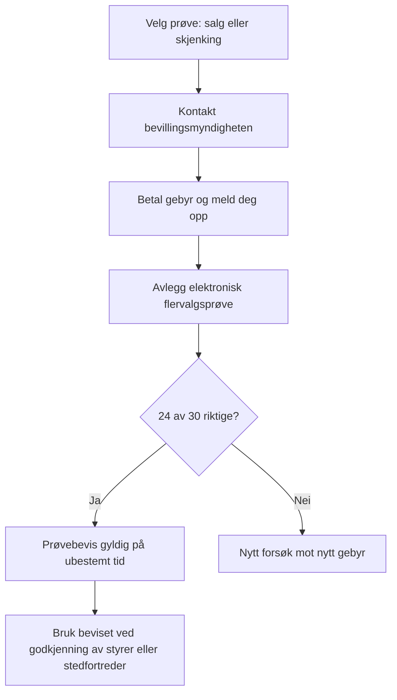

# Kunnskapsprøven i alkoholloven i Norge

## Kort executive summary

For Kunnskapsprøven i alkoholloven må du først og fremst kunne den gjeldende **alkoholloven**, **alkoholforskriften** og hvordan disse brukes i praksis gjennom Helsedirektoratets rundskriv og veiledere. Offisielt pensum er delt mellom **salgsbevilling** og **skjenkebevilling**, men Helsedirektoratet presiserer samtidig at du også må kjenne til alkohollovens øvrige bestemmelser. I praksis betyr det at du må forstå både hovedreglene og hvordan de henger sammen med kontroll, internkontroll, reaksjoner, reklameforbud, arrangementstyper, ulovlig omsetning og lokale kommunale regler. citeturn25search1turn25search3turn9search5

Det mest eksamensnære stoffet er reglene om **aldersgrenser**, **legitimasjon**, **åpenbart påvirkede personer**, **salgs- og skjenketider**, **bevillingssystemet**, **styrer og stedfortreder**, **internkontroll**, **kontroll og prikktildeling**, samt **særskilte forbud** som medbrakt alkohol, reklame, ulovlig kjøp på vegne av mindreårige og hjemmebrent. Dette er også reglene som kommunen særlig skal kontrollere, og de som oftest leder til prikker og inndragning. citeturn32view0turn33view0turn10search3turn22search0turn15search3

Prøven er en **elektronisk flervalgsprøve** på **60 minutter** med **30 spørsmål**, og du må ha **24 riktige** for å bestå. Gebyret er **400 kroner**, betales på forhånd, og nytt forsøk koster nytt gebyr. Prøven avlegges normalt hos kommunen, og bevillingsmyndigheten skal avholde prøven innen to måneder etter at melding om ønsket prøve er mottatt. Prøvebeviset er gyldig på ubestemt tid. citeturn25search1turn25search3turn25search0turn40view0

Det finnes lokale variasjoner, men de gjelder hovedsakelig **oppmelding, betalingsløsning, legitimasjonskrav, praktisk gjennomføring, lokale alkoholpolitiske retningslinjer og lokale salgs-/skjenketider**. Derfor må du alltid lese både nasjonale kilder og kommunens egne sider og forskrifter før du går opp, særlig hvis du skal være styrer eller stedfortreder i en bestemt kommune. citeturn40view2turn40view1turn26view0turn12search10

## Offisielle kilder og rettslig ramme

Det sikreste kildesettet for eksamensforberedelse er dette: **Lovdata** for gjeldende lov- og forskriftstekst, **Helsedirektoratets temaside om kunnskapsprøven** for offisielt pensum og prøveinformasjon, **Alkoholloven med kommentarer** og **Alkoholforskriften med kommentarer** for tolkning og praksis, samt **Helsedirektoratets veiledning om internkontroll** og siden om **kontroll og inndragning** for hvordan reglene brukes i den kommunale hverdagen. Lokalt må du supplere med kommunens alkoholpolitiske handlingsplan, lokale forskrifter om tider og eventuelle retningslinjer for bevillinger og prøver. citeturn25search1turn9search5turn30search5turn33view0turn32view0turn40view2turn40view1

Rent juridisk bør du lese materialet i denne rekkefølgen: **lovtekst først**, deretter **forskrift**, så **Helsedirektoratets kommentarer**, og til slutt **kommunale forskrifter, handlingsplaner og konkrete vedtak**. Tolkningsmessig er lovens formål viktig: alkoholloven skal begrense alkoholskader og forbruk. Når ordlyden er uklar, er det derfor ofte riktig å velge den forståelsen som best ivaretar kontroll, forsvarlighet og begrensning av tilgjengelighet. Kommunene har samtidig et betydelig skjønn innenfor lovens rammer, blant annet når de vurderer om bevilling bør gis og når de fastsetter lokale tider og vilkår. citeturn11search4turn13search10turn11search1turn11search2turn12search10

Et grunnleggende tolkningsgrep på prøven er å holde fast ved skillet mellom **salg** og **skjenking**. Salg er overdragelse mot vederlag for drikking **utenfor** salgsstedet, mens skjenking er salg for drikking **på stedet**. Mange vanskelige eksamensspørsmål handler egentlig om dette skillet: om noe er et salgssted eller skjenkested, om alkohol kan tas ut av lokalet, eller om et arrangement er bevillingspliktig. citeturn38search1turn38search0turn18search10turn36search6

## Pensumkart og temaoversikt

Helsedirektoratet opererer med ulike pensumlister for salgs- og skjenkebevilling, og alkoholforskriften § 5-4 skiller også mellom hva du skal ha **kunnskap om** og hva du bare skal ha **kjennskap til**. I praksis er det klokt å lese hele de oppgitte kapitlene grundig og bruke de øvrige kapitlene som støtte for helhetsforståelsen. citeturn25search1turn25search3

| Prøve | Kapitler du må kunne godt | Kapitler du må kjenne til | Hva dette betyr i praksis |
|---|---|---|---|
| Salgsbevilling | Alkoholloven kap. 1, 3, 7, 8 og 9. Alkoholforskriften kap. 1, 2, 3, 5, 6, 8, 9, 10, 11 og 14 | Alkoholloven kap. 2, 4, 5, 6 og 10 | Tyngde på butikk/nettsalg, utlevering, tider, plassering, automatforbud, internkontroll, kontroll, prikker og reklame |
| Skjenkebevilling | Alkoholloven kap. 1, 4, 5, 7, 8 og 9. Alkoholforskriften kap. 1, 2, 4, 5, 6, 8, 9, 10, 11 og 14 | Alkoholloven kap. 2, 3, 6 og 10 | Tyngde på skjenkested, rusvurdering, adgang/nekt, medbrakt alkohol, alkoholfrie alternativer, arrangementer og kontroll |

Tabellen over er en direkte sammenfatning av Helsedirektoratets pensumsider og alkoholforskriften § 5-4. citeturn25search1turn25search3turn40view0

| Rolle | Formelt ansvar | Det du bør kunne til prøven |
|---|---|---|
| Bevillingshaver | Har det overordnede ansvaret for at driften er lovlig og forsvarlig | Hvem som er ansvarssubjekt for internkontroll, gebyr, vilkår og brudd |
| Styrer | Skal ha styringsrett over salg/skjenking og føre tilsyn med utøvelsen av bevillingen | Styrer er ikke bare et navn på papiret; rollen bærer reelt ansvar |
| Stedfortreder | Trer inn når styrer er fraværende | Samme plikter som styrer når styrer ikke er til stede |
| Daglig leder | Er særlig relevant etter serveringsloven, ikke som erstatning for styrer etter alkoholloven | Skill mellom serveringslovens daglig leder og alkohollovens styrer/stedfortreder |
| Kommune | Bevillingsmyndighet, kontrollmyndighet og ofte prøvearrangør | Skjønnsutøvelse, handlingsplan, kontroll og inndragning |
| Kontrollør | Utfører kontroll på kommunens vegne | Må ha egen kunnskapsprøve for kontrollører |

Denne ansvarsoversikten bygger på alkoholloven § 1-7c, alkoholforskriften § 2-2, internkontrollveilederen og kommunale praksissider fra blant annet Bergen. citeturn13search1turn31search1turn31search3turn33view0turn32view0turn40view1

**Formål, definisjoner og alkoholgrupper.** Start med § 1-1, § 1-3 og alkoholforskriften kapittel 1. Du må kunne at alkoholfri drikk er under 0,7 volumprosent, alkoholsvak drikk er 0,7–2,5, gruppe 1 er over 2,5 til og med 4,7, gruppe 2 er over 4,7 og under 22, og gruppe 3 er fra og med 22 til og med 60. Dette styrer rettigheter, aldersgrenser, salgstider, skjenketider og gebyrer. Praktisk eksempel: 4,7 % øl er gruppe 1, mens 22 % likør er gruppe 3. Vanlig feil: å blande sammen grensene 2,5, 4,7, 22 og 60 prosent. citeturn37search1turn37search0turn11search4

**Bevillingsplikt og bevillingssystem.** Salg, skjenking og tilvirkning krever i utgangspunktet bevilling. Salg gjelder konsum utenfor stedet; skjenking gjelder konsum på stedet. Kommunen er hovedregel bevillingsmyndighet, men det finnes statlige unntak for enkelte tog, fly, skip og befalsmesser. Praktisk eksempel: et åpent festivalområde trenger normalt en bevilling for en enkelt bestemt anledning, mens et bryllup i et selskapslokale kan falle inn under ambulerende bevilling hvis vilkårene er oppfylt. Vanlig feil: å tro at all alkoholservering i private eller halvoffentlige lokaler er bevillingsfri. citeturn38search1turn38search0turn13search2turn11search15turn12search2turn12search3turn18search10

**Kommunens skjønn, vandel og nøkkelroller.** Kommunen kan legge vekt på antall salgs- og skjenkesteder, stedets karakter, beliggenhet, målgruppe, ordensforhold, næringspolitiske hensyn og hensynet til lokalmiljøet. Bevillingssøker og personer med vesentlig innflytelse må oppfylle vandelskravet, og hver bevilling skal ha styrer og normalt stedfortreder. Praktisk eksempel: en søknad kan avslås selv om formkravene er oppfylt, dersom kommunen mener beliggenhet eller ordensforhold taler imot. Vanlig feil: å tro at bestått kunnskapsprøve alene gir rett til bevilling. citeturn13search10turn13search0turn13search1turn31search2

**Serveringsansvarlig, daglig leder og forholdet til serveringsloven.** I alkoholloven er de sentrale rollene **bevillingshaver**, **styrer** og **stedfortreder**. På skjenkesteder kommer ofte også krav etter **serveringsloven** inn, blant annet serveringsbevilling og daglig leder med etablererprøve. Bergen kommune opplyser uttrykkelig at skjenkebevilling ikke kan gis alene, at det også må foreligge serveringsbevilling, og at styrer i tillegg må ha bestått etablererprøven. Vanlig feil: å bruke ordet «serveringsansvarlig» som om det var en formell alkohollovsrolle. Det er bedre å skille presist mellom daglig leder etter serveringsloven og styrer/stedfortreder etter alkoholloven. citeturn25search2turn40view1turn41search1

**Salg av alkohol.** For salg er kjernepunktene hvem som kan selge, hvor det kan selges og når det kan selges. Gruppe 1 kan selges på grunnlag av kommunal bevilling, mens gruppe 2 og 3 i hovedsak selges av Vinmonopolet, med enkelte unntak. Salgstidene for gruppe 1 er lovfastsatt med lokale variasjonsmuligheter: normalt 08.00–18.00 og 08.00–15.00 før søn- og helligdager, men aldri senere enn 20.00 på hverdager eller 18.00 på dager før søn- og helligdager; dessuten er salg forbudt på søn- og helligdager samt 1. og 17. mai. Det må ikke drikkes i salgslokalet, salg/utlevering til åpenbart påvirkede personer er forbudt, salg fra automat er forbudt, og alkohol kan ikke være plassert slik at den kan forveksles med alkoholfri eller alkoholsvak drikk. Kiosk og bensinstasjon kan ikke få salgsbevilling. Praktiske eksempler: en butikk som lar kunder åpne øl i butikken bryter § 3-2; en bensinstasjon med stort dagligvaresortiment kan likevel regnes som bensinstasjon; en nettbutikk må fortsatt kontrollere alder og utleveringstid. Vanlige feil: å glemme søndagsforbudet, å tro at selvbetjente hentepunkter er lovlige, eller å overse plassering i hylle/kjøleskap. citeturn21search10turn11search1turn9search6turn18search5turn21search2turn21search11turn35search0turn35search1

**Skjenking av alkohol.** For skjenking må du kunne omfanget av bevillingen og de sentrale driftsreglene. Bevillingen kan gjelde gruppe 1, gruppe 1–2 eller alle grupper opp til 60 volumprosent. Det er forbudt å gi adgang til åpenbart påvirkede personer, og slike personer som befinner seg på stedet må bortvises; dessuten er det forbudt å skjenke noen som er åpenbart påvirket eller som må antas å bli det. Gjestene må bare nyte skjenket alkohol, ikke medbrakt alkohol, og de kan ikke ta alkohol med ut av skjenkeområdet. Brennevin kan bare skjenkes i 2 og 4 cl, med unntak for cocktails. Skjenkestedet må føre et rimelig utvalg alkoholfrie eller alkoholsvake alternativer, føre et rimelig utvalg halvflasker når slike er i handelen, og på hotellrom kan minibar tillates dersom mindreårige ikke får tilgang. Praktiske eksempler: et utested kan ikke sende med en flaske vin «til nachspiel»; en restaurant må ha reelle alkoholfrie alternativer på menyen; en bartender kan ikke fortsette å servere et bord der én person er tydelig ruspåvirket. Vanlige feil: å tro at medbrakt alkohol bare er problematisk hvis personalet ser den bli tatt inn, eller å overse plikten til å tilby alkoholfrie alternativer. citeturn19search1turn10search3turn36search5turn20search1turn19search3turn30search0turn30search1turn19search7

**Aldersgrenser, legitimasjon og langing.** Dette er et av de mest sentrale eksamenstemaene. Under 18 år kan ikke få alkoholsvak drikk eller alkohol i gruppe 1 og 2; under 20 år kan ikke få gruppe 3. Den som selger eller skjenker må som hovedregel være 18 år for gruppe 1 og 2 og 20 år for gruppe 3, med enkelte opplæringsunntak. Ved tvil om alder har ansatte rett og plikt til å kreve legitimasjon, og internkontrollveilederen anbefaler å be om legitimasjon for alle som ser ut til å være under 25 år. Det er også forbudt å kjøpe alkohol på vegne av mindreårige, og på skjenkested må det påses at mindreårige ikke drikker alkohol som er kjøpt av andre. Praktiske eksempler: en 19-åring kan ikke kjøpe eller få servert brennevin; en mindreårig kan ikke drikke av foreldrenes vin på restaurant; en kunde uten legitimasjon skal avvises ved tvil. Vanlige feil: å blande sammen alderen til kunden og alderen til den ansatte, eller å tro at foreldres samtykke eller fullmakt gjør dette lovlig. citeturn18search2turn37search11turn21search0turn18search9turn22search0turn22search1turn21search1

**Internkontroll og forsvarlig drift.** Alle salgs- og skjenkesteder skal ha internkontrollsystem. Kravene følger av alkoholloven § 1-9 femte ledd og alkoholforskriften kapittel 8, og må sees i sammenheng med forsvarlighetskravet i § 3-9 og § 4-7. Systemet skal kartlegge risiko, beskrive forebyggende rutiner og vise hvordan rutiner følges opp i praksis. Praktisk eksempel: stedet bør ha faste rutiner for alderskontroll, konflikthåndtering, opplæring av ansatte, loggføring av hendelser og oppfølging av feil. Vanlige feil: å ha et «internkontrolldokument» som ingen ansatte kjenner til, eller å tro at internkontroll bare er et papirkrav. citeturn33view0turn14search14turn21search12

**Kontroll, prikker, inndragning og politiets stengningsadgang.** Kommunen skal føre kontroll med alle steder, hvert sted minst én gang årlig, og totalt minst tre ganger så mange kontroller som antall bevillingssteder i kommunen. Kontrollene skal særlig omfatte tider, aldersgrenser og salg/skjenking til åpenbart påvirkede personer. Brudd gir prikker; 12 prikker i løpet av to år gir som standard én ukes inndragning. Åtte prikker gis blant annet for salg/skjenking til personer under 18 år, brudd på bistandsplikten, hindring av kontroll og uforsvarlig drift; fire prikker gis blant annet for salg/skjenking til åpenbart påvirkede eller brudd på tidsbestemmelsene; to prikker gis blant annet for mangler ved internkontroll, manglende gebyrbetaling eller manglende omsetningsoppgave; én prikk gjelder blant annet alkoholfrie alternativer, medbrakt alkohol, reklameforbud og vilkårsbrudd. Politiet kan i tillegg stenge steder uten bevilling eller i inntil to dager av hensyn til ro, orden og sikkerhet. Praktiske eksempler: manglende internkontrollsystem gir prikker selv om ingen mindreårig faktisk ble servert; nekter stedet kontrollører adgang, er det et alvorlig brudd. Vanlige feil: å undervurdere dokumenttilsyn og å tro at bare «fysiske» overtredelser teller. citeturn14search0turn32view0turn30search9turn14search5turn28search3

**Skjenke- og salgstider, lokale forskrifter og vilkår.** Tidsreglene er både nasjonale og lokale. For skjenking er normaltidene 08.00–01.00 for gruppe 1 og 2, og 13.00–24.00 for gruppe 3, mens kommunen kan innskrenke eller utvide innenfor lovens maksimum. Konsum av utskjenket alkohol må opphøre senest 30 minutter etter skjenketidens utløp. For salg av gruppe 1 fastsetter kommunen tidene innenfor lovens maksimumsrammer. Kommuner kan dessuten ha egne åpningstidsforskrifter og vilkår, slik Oslo har, og bydeler kan i enkelte tilfeller fastsette egne åpningstider. Praktiske eksempler: et sted kan ha kortere tider på uteserveringen enn inne; lokale vilkår om konsept, vakthold eller uteservering må også følges. Vanlige feil: å svare med nasjonal normaltid når oppgaven egentlig spør etter kommunal adgang til å avvike innenfor rammen. citeturn11search2turn36search0turn30search4turn40view2turn9search3

**Bevillingsperiode, gebyr, omsetningsoppgave og overdragelse.** Kommunale bevillinger kan gis for inntil fire år av gangen med opphør senest 30. september året etter at nytt kommunestyre tiltrer, og kommunen kan beslutte at bevillinger skal løpe videre i en ny periode. Det skal betales årlig bevillingsgebyr, beregnet ut fra forventet omsatt mengde, med minimumsgebyrer fastsatt i forskriften. Ved overdragelse faller bevillingen bort, men ny eier kan i en overgangsperiode drive videre på tidligere bevilling dersom kommunen underrettes og ny bevilling søkes raskt. Varebeholdningen kan overdras etter særskilte regler i alkoholforskriften kapittel 11. Praktisk eksempel: en kjøper av restaurant kan ikke bare fortsette «som før» uten å melde fra til kommunen og søke ny bevilling. Vanlige feil: å tro at bevillingen følger virksomheten automatisk, eller å glemme at manglende omsetningsoppgave og gebyrbetaling også gir prikker. citeturn28search0turn24search16turn24search6turn24search13turn28search2turn29search0turn32view0

**Arrangementer, sluttet selskap, ambulerende bevilling og enkelt anledning.** Ambulerende bevilling etter § 4-5 er tenkt brukt for sluttede selskaper som bryllup og jubileer, mens bevilling for en enkelt bestemt anledning typisk brukes for åpne arrangementer som festivaler. For en enkelt bestemt anledning er saksbehandlingen enklere, og kravet om bestått kunnskapsprøve gjelder normalt ikke, med mindre innehaveren skal kjøpe alkohol engros. Ambulerende bevilling gir ikke adgang til engrossalg. Ved vurderingen av «sluttet selskap» er det de faktiske forholdene som teller, ikke bare hva arrangøren kaller arrangementet. Praktiske eksempler: et bryllup med invitert gjesteliste kan være sluttet selskap; et arrangement som annonseres åpent på sosiale medier er normalt ikke det. Vanlige feil: å behandle «lukket arrangement» og «sluttet selskap» som rene ordvalg uten innhold, eller å tro at ambulerende bevilling er en generell festivalbevilling. citeturn12search2turn12search0turn37search2turn31search5turn19search12

**Engrossalg, innførsel, transport, oppbevaring og egen tilvirkning.** Engrossalg er et eget spor som krever registrering, og engrossalg kan bare skje til aktører som har rett til å motta den aktuelle drikken. Alkohol må komme fra lovlige leverandører; skjenkested kan bare skjenke alkohol levert av noen med tilvirknings- eller salgsbevilling eller rett til engrossalg. Innførsel fra utlandet er også regulert, og utvidet salgs- eller skjenkebevilling kan i noen tilfeller gi rett til innførsel eller egen tilvirkning innen snevre rammer. Ulovlig forvaring og lagring av alkohol er forbudt, og hjemmebrenningsapparater er også forbudt. Praktiske eksempler: en bar kan ikke kjøpe «billig privatimportert» brennevin fra en privatperson; en ambulerende bevilling gir ikke rett til engroskjøp; en virksomhet med utvidet egenproduksjon kan ikke automatiske drive engrossalg. Vanlige feil: å glemme grossistleddet og å tro at all egenproduksjon til eget bruk eller servering er fri. citeturn23search1turn8search5turn31search10turn24search3turn23search4turn16search5turn23search13

**Reklame, merking og nøkterne opplysninger.** Reklameforbudet i § 9-2 er vidt og medienøytralt. Det omfatter både direkte reklame for alkohol, reklame for andre varer med samme merke/kjennetegn og at alkohol inngår i markedsføring av andre varer eller tjenester. Samtidig finnes det snevre unntak i alkoholforskriften kapittel 14 for nøkterne, produktspesifikke fakta- og prisopplysninger, blant annet på nettsider, men opplysningene må ikke fremheve alkohol fremfor andre produkter. Gratis utdeling i markedsføringsøyemed er også særskilt forbudt. Praktiske eksempler: «happy hour»-lignende markedsføring vil typisk være problematisk; en nøktern vinliste kan være lovlig hvis den ikke fremhever alkoholholdig drikk i reklameøyemed. Vanlige feil: å tro at reklameforbudet bare gjelder annonser, eller at «nøytral informasjon» gir fritt spillerom i sosiale medier. citeturn15search3turn23search9turn23search7turn23search11turn15search2

**Særskilte forbud, hjemmebrenning og ulovlig omsetning.** Alkoholloven kapittel 8 inneholder en rekke spørsmål som ofte blir brukt for å teste grenseforståelse. Det er forbudt å tilvirke eller omdestillere brennevin uten tillatelse, forbudt å lagre ulovlig tilvirket eller ulovlig omsatt alkohol, forbudt å kjøpe ulovlig tilvirket brennevin, forbudt å kjøpe alkohol på vegne av mindreårige, forbudt å bruke alkohol som premie eller gevinst, og forbudt å selge, skjenke eller omsette brennevin over 60 volumprosent. Videre er det serverings- og drikkeforbud i bestemte lokaler og steder uten skjenkebevilling, selv når serveringen skjer uten vederlag. Praktiske eksempler: hjemmebrent er ikke bare et «produksjonsproblem», men også et lagrings- og kjøpsproblem; en konkurransepremie i form av vin er ulovlig i offentlig sammenheng; gratis smaksprøver for å promotere et produkt kan rammes. Vanlige feil: å tro at privat eller gratis utdeling alltid er lovlig, eller å overse 60-prosentgrensen. citeturn16search0turn23search0turn22search0turn15search1turn10search2turn10search7turn16search2

## Prøveformat, registrering og lokale variasjoner

Kunnskapsprøven for styrer og stedfortreder er formelt regulert i alkoholforskriften kapittel 5. Den er en elektronisk flervalgsprøve på 60 minutter, og bestått prøve dokumenterer at kandidaten har tilstrekkelig kunnskap om lov og forskrift for den relevante bevillingstypen. Dersom kandidaten ikke består, kan vedtaket ikke påklages, men prøven kan tas på nytt uten noen fastsatt øvre grense mot betaling av nytt gebyr. citeturn25search3turn25search0turn25search2

Oppmelding skjer som hovedregel hos bevillingsmyndigheten. For kommunale salgs- og skjenkebevillinger er dette kommunen; for statlig skjenkebevilling til skip er det statsforvalteren; for tog og fly er det Helsedirektoratet. Bevillingsmyndigheten har plikt til å avholde prøven innen to måneder etter at melding om ønsket prøve er mottatt. Gebyret er 400 kroner og skal betales på forhånd. citeturn25search1turn25search2

Helsedirektoratets kommentarer til § 5-4 legger opp til at kandidaten skal ha et minimum av norskkunnskaper. Prøven avlegges derfor på norsk. Kommunale sider fra Oslo og Bergen bekrefter dette, og angir også at tolk ikke er tillatt, mens norsk ordbok kan brukes på kunnskapsprøven. Prøvebeviset er gyldig på ubestemt tid. citeturn25search3turn40view0turn41search0

Denne prosessmodellen er en sammenfatning av alkoholforskriften kapittel 5 og kommunale gjennomføringssider fra Oslo og Bergen. citeturn25search2turn25search3turn40view0turn41search0

Lokale variasjoner handler mest om **praktikk**, ikke om de nasjonale kunnskapskravene. Oslo opplyser at påmelding skjer via ID-porten, betaling kan skje med Vipps, og at kandidater med særskilte behov kan få tilrettelegging; Bergen opplyser at betaling skjer ved påmelding og at prøvebevis deles ut ved bestått prøve; Sandefjord opplyser at prøven kun kan besvares elektronisk, at det ikke er begrensning i antall forsøk, og at «lokale bestemmelser» inngår i lovverksdelen for skjenkebevilling. Dette viser hvorfor du alltid må lese kommunens egen prøveside i tillegg til de nasjonale kildene. citeturn41search0turn40view0turn26view0

Lokale alkoholregler kan også være materielle. Oslo har for eksempel en egen åpningstidsforskrift som regulerer åpnings- og skjenketider for serverings- og skjenkesteder og salgstider i butikk og ved nettsalg, og bydelsutvalg kan i tillegg fastsette åpningstider i egen bydel. Bergen viser på sine sider til egne retningslinjer for tildeling av salgs- og skjenkebevillinger. Det betyr at en eksamenskandidat bør kunne nasjonal rett fullt ut, men samtidig ha oversikt over de konkrete lokale rammene der vedkommende faktisk skal være styrer eller stedfortreder. citeturn40view2turn40view1turn12search10

## Studie- og forberedelsestips

Den mest effektive leseplanen er å starte med **tallene og tersklene**, fortsette med **rolle- og ansvarsreglene**, og deretter jobbe tematisk med **salg**, **skjenking**, **internkontroll**, **kontroll/prikker** og **særforbud**. Det er fordi disse emnene både er eksplisitt pensum og i praksis ligger i kjernen av kommunal kontrollvirksomhet. Den offisielle kontrollsiden fra Helsedirektoratet viser tydelig at tider, aldersgrenser og åpenbart påvirkede personer er kontrollens hovedfokus, samtidig som internkontroll og forsvarlig drift er gjennomgående ansvarstemaer. citeturn32view0turn33view0

Hvis du vil prioritere hardt, bør du først memorere disse nøkkelområdene: forskjellen på **salg og skjenking**; alkoholgruppene og prosentgrensene; aldersgrensene for kunde og ansatt; reglene om legitimasjon, langing og mindreårige som drikker av andres alkohol; tidsreglene; forbudet mot salg/skjenking til åpenbart påvirkede; medbrakt alkohol og alkohol ut av lokalet; internkontroll; prikkesystemet; reklameforbudet; og forskjellen mellom **ambulerende bevilling** og **enkelt bestemt anledning**. Dette er områdene der mange feil på prøven typisk oppstår. citeturn37search1turn18search2turn22search0turn36search5turn33view0turn32view0turn15search3turn12search0turn12search2

En god studieteknikk er å gjøre hvert lovpunkt om til et lite case. Spør deg selv: *Hvilken type sted er dette? Hvilken alkoholgruppe gjelder det? Hvem er kunden? Hvilken alder har kunden og den ansatte? Er det salg eller skjenking? Er det innenfor tid? Er det lovlig leverandør? Finnes det et lokalt vilkår? Hva blir reaksjonen hvis stedet gjør feil?* Denne måten å lese på ligner bedre på hvordan spørsmålene faktisk er formulert enn ren pugging av overskrifter. citeturn38search1turn32view0turn33view0

Sjekklisten under er laget for ren eksamensforberedelse og bygger direkte på de offisielle kildene:

- Les Helsedirektoratets side om **kunnskapsprøven** og noter eksakt pensum for din bevillingstype. citeturn25search1turn25search3
- Les deretter gjeldende **alkohollov** og **alkoholforskrift** i Lovdata, med særlig vekt på de kapitlene som er markert som «kunnskap om». citeturn25search1turn30search5turn17search10
- Bruk **Helsedirektoratets kommentarer** for alle tvilsomme ord og grensespørsmål, særlig «åpenbart påvirket», «sluttet selskap», «forsvarlig drift» og «nøkterne opplysninger». citeturn10search3turn37search2turn14search14turn23search7
- Les **internkontrollguiden** og **kontroll/prikkesystemet** som om du var kontrollør; det gjør deg bedre på praktiske spørsmål. citeturn33view0turn32view0
- Gå gjennom kommunens egne sider for **kunnskapsprøven**, **alkoholpolitiske retningslinjer** og **salgs-/skjenketider**. citeturn40view2turn40view1turn26view0
- Hvis du skal opp til **skjenkeprøven**, kontroller også hvilke krav som følger av **serveringsloven** og etablererprøven, slik at du ikke blander regelsettene. citeturn25search2turn40view1turn41search1
- Øv særskilt på «klassiske» feilspørsmål: mindreårig med foreldrene til stede, 19-åring som bestiller drink med 22 % sprit, gjest som tar med øl ut, nettbestilling uten fullstendige opplysninger, butikk som lar kunder drikke i lokalet, og reklame som ser «nøytral» ut men likevel fremmer alkohol. citeturn22search1turn18search2turn36search5turn35search2turn18search3turn23search9

## Primærkilder og hvordan du finner lokale regler

De viktigste primærkildene for denne prøven er **alkoholloven**, **alkoholforskriften**, **Helsedirektoratets side om Kunnskapsprøve i alkoholloven**, **Alkoholloven med kommentarer**, **Alkoholforskriften med kommentarer**, **Guide til god internkontroll etter alkoholloven**, og **Kontroll og inndragning av salgs- og skjenkebevilling – prikktildelingssystem**. For skjenkesteder bør du i tillegg ha et sideblikk på **serveringsloven** og kommunens informasjon om etablererprøven, fordi styrer/daglig leder-kravene ofte behandles parallelt lokalt. citeturn25search1turn9search5turn30search5turn33view0turn32view0turn40view1turn41search1

For å finne lokale regler i den kommunen der du faktisk skal arbeide, er den tryggeste fremgangsmåten å bruke tre spor samtidig. Først: kommunens egen side om **kunnskapsprøven**, fordi den gir oppmelding, språk, legitimasjonskrav og lokal praktisk gjennomføring. Deretter: kommunens sider om **salgs-/skjenkebevilling**, fordi de viser lokale vilkår, krav til serveringsbevilling, retningslinjer og ofte lenker til søknadsskjemaer. Til slutt: søk opp kommunens **alkoholpolitiske handlingsplan** og eventuelle lokale **forskrifter om åpningstider eller salgs-/skjenketider** i Lovdata eller på kommunens nettsted. Dette er nøyaktig den modellen Oslo, Bergen og Sandefjords egne sider peker mot. citeturn41search0turn40view1turn40view2turn26view0turn27search4turn27search7

Hvis du vil bruke en praktisk tommelfingerregel, bør du lete etter dokumenter og sider med disse ordene i kommunenavnet: **«kunnskapsprøve alkoholloven»**, **«alkoholpolitisk handlingsplan»**, **«retningslinjer for salgs- og skjenkebevillinger»**, **«åpningstidsforskrift»**, **«salgstider»** og **«skjenketider»**. Ser du at kommunen også har egne sider for godkjenning av ny styrer, stedfortreder eller daglig leder, er det et tegn på at du bør lese kommunens lokale praksis ekstra nøye før du går opp til prøven eller søker godkjenning. citeturn40view1turn40view2turn39search5turn39search6

Den viktigste praktiske konklusjonen er derfor denne: **les nasjonalt for å bestå prøven, men les lokalt for å fungere lovlig i stillingen**. Kunnskapsprøven tester lovforståelse, men styrer- og stedfortrederrollen utøves alltid i en konkret kommune med egne rutiner, forskrifter og alkoholpolitiske prioriteringer. citeturn25search1turn13search1turn40view2turn40view1turn26view0